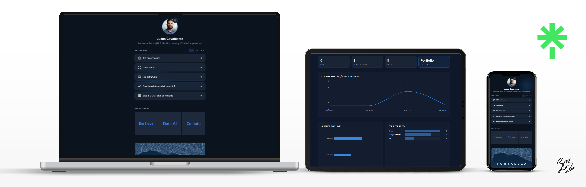

# 🌐 LinkTree Cavalcante

<p align="center">
  
</p>

Uma landing page pessoal estilo Linktree — moderna, mobile-first, dark mode e com superpoderes:

- 🔗 **Projetos dinâmicos do portfólio** — 5 projetos buscados via API com fallback, seletor PT/EN/ES e modal com detalhes
- ✂️ **Encurtador de URL no domínio próprio** (`link.seudominio.com/abc123`)
- 📸 **Feed do Instagram dinâmico** (com fallback quando a API falha)
- 📊 **Analytics de cliques** (opcional, sem depender de serviços externos)
- 📈 **Dashboard visual** em `/dashboard` com gráficos Recharts, animações por seção com scroll (IntersectionObserver) (opcional, com senha ou aberto)
- 🔘 **Bordas neon glow** em botões e avatar com intensificação no hover
- 🔗 **Ícones de redes sociais** circulares com neon glow
- 🖱️ **Glow interativo no background** — brilho azul que acompanha o movimento do mouse com suavização
- 📍 **Card de localização** com mapa SVG blueprint (Terraink) + link Google Maps
- 🌀 **Efeito tilt 3D + ripple** no container principal ao mover/clicar
- 🌟 **Animações de entrada** — fade-in + slide-up progressivo em cada seção da página principal (100–500ms delay)

---

## 🚀 Stack

| Camada | Tecnologia |
|---|---|
| Framework | Next.js 16 (App Router) |
| Estilização | Tailwind v4 + Dark Mode |
| Analytics (opcional) | Upstash Redis (via Vercel Marketplace) |
| Deploy | Vercel (free tier) |
| Testes | Playwright |

> O analytics via Upstash Redis é **opcional** — sem configurar, o site funciona normalmente com fallbacks estáticos.

---

## 📁 Estrutura do Projeto

```
├── app/                    # Rotas do Next.js (App Router)
│   ├── page.tsx            # Página principal (Linktree)
│   ├── layout.tsx          # Layout global com dark mode + footer
│   ├── globals.css         # Estilos globais + Tailwind
│   ├── dashboard/          # Dashboard analytics
│   ├── [shortcode]/        # Encurtador de URL
│   └── api/                # API routes (analytics, instagram, dashboard)
├── components/             # Componentes reutilizáveis
│   ├── ProfileHeader.tsx   # Avatar + bio (linkável ao GitHub com neon glow)
│   ├── LinkButton.tsx      # Botão de link com neon glow no hover
│   ├── SocialIcons.tsx     # LinkedIn, GitHub, Instagram, WhatsApp (círculos neon)
│   ├── InstagramFeed.tsx   # Grid de posts do Instagram com stagger animation
│   ├── LocationCard.tsx    # Endereço + mapa SVG blueprint
│   ├── Footer.tsx          # Footer com assinatura
│   ├── PoolEffect.tsx      # Glow background que segue o mouse
│   ├── MouseInteraction.tsx # Tilt 3D + ripple no clique
│   ├── ProjectLinks.tsx    # Botões de projetos com seletor PT/EN/ES
│   ├── ProjectModal.tsx    # Modal de projeto (backdrop + tech tags + Demo/Código)
│   └── dashboard/          # Componentes do dashboard (Recharts + AnimatedSection)
├── app/api/projects/       # API de projetos do portfólio (ISR 30min)
├── config/                 # Configurações e conteúdo
│   ├── links.config.ts     # Lista de links do perfil
│   ├── instagram-mock.config.ts  # Posts mockados (fallback)
│   ├── shortener-static.config.ts # Shortcodes estáticos
│   ├── projects-mock.config.ts    # Projetos mockados (fallback)
│   └── projects-translations.ts    # Traduções PT/EN/ES dos projetos
├── lib/                    # Lógica de negócio
│   ├── kv.ts               # Cliente Upstash Redis
│   ├── instagram.ts        # Wrapper da API do Instagram
│   ├── shortener.ts        # Resolução de short codes
│   ├── icons.ts            # SVGs dos ícones (~30 paths)
│   ├── projects.ts         # Fetch projetos + traduções
│   ├── dashboard-api.ts    # Queries do dashboard
│   └── dashboard-auth.ts   # Autenticação do dashboard
├── scripts/                # Utilitários
├── public/images/          # Imagens locais (avatar, assinatura, thumbnail)
├── docs/                   # Documentação de referência
├── CONTENT.md              # Conteúdo real (preencha aqui!)
├── CHANGELOG.md            # Histórico de versões
├── TODO.md                 # Próximos passos
└── .env.example            # Variáveis de ambiente
```

---

## 🛠️ Começando

### Pré-requisitos

- Node.js 18+
- npm

### Instalar

```bash
git clone <seu-repo>
cd linktree_cavalcante
npm install
```

### Rodar em desenvolvimento

```bash
npm run dev
```

Acesse [http://localhost:3000](http://localhost:3000).

### Build para produção

```bash
npm run build
npm start
```

---

## 🔧 Configuração

### 1. Conteúdo do perfil

Edite o arquivo **`CONTENT.md`** com suas informações reais (bio, links, avatar, etc).

Depois, preencha **`config/links.config.ts`** com seus links:

```ts
export const links = [
  { label: "Instagram", url: "https://instagram.com/seuperfil" },
  { label: "WhatsApp", url: "https://wa.me/5511999999999" },
  { label: "Portfólio", url: "https://seuportfolio.com" },
];
```

### 2. Variáveis de ambiente (opcional)

Copie `.env.example` para `.env.local` e preencha se quiser usar Instagram real e/ou dashboard com senha:

```bash
cp .env.example .env.local
```

Todas as variáveis são **opcionais** — o site funciona sem elas usando fallbacks.

### 3. Instagram (opcional)

Se for usar o feed real do Instagram:
1. Obtenha um token de acesso de longa duração da Meta Graph API
2. Pegue seu Instagram Business Account ID
3. Preencha `INSTAGRAM_ACCESS_TOKEN` e `INSTAGRAM_BUSINESS_ACCOUNT_ID` no `.env.local`

> Sem token, o feed usa posts mockados definidos em `config/instagram-mock.config.ts`.

### 4. Upstash Redis (analytics)

O dashboard de analytics usa **Upstash Redis** via Vercel Marketplace.
Na Vercel, vá em **Marketplace → Upstash Redis** e crie um banco (as env vars são injetadas automaticamente).
Localmente, o dashboard funciona sem Redis em modo fallback (dados zerados).

### 5. Dashboard Analytics (opcional)

O dashboard fica em `/dashboard` com gráficos de cliques por dia, por link, top referrers e tabela dos últimos cliques.

| Env var | Função |
|---------|--------|
| `DASHBOARD_PASSWORD` | **Opcional.** Se não definida, dashboard aberto. Se definida, exige login. |

```bash
# Sem senha — dashboard aberto (apenas não defina a env var)
# Com senha — adicione no .env.local:
DASHBOARD_PASSWORD=sua_senha
```

### Funcionalidades visuais

| Componente | Descrição |
|---|---|
| **AnimatedSection** | Fade-in + slide-up com delay configurável, usado nas seções da página principal |
| **Neon Glow** | `box-shadow` multi-camada em botões, avatar e ícones sociais; intensifica no hover |
| **Mouse Glow** | Glow azul Corporate Blue no background que segue o cursor com suavização (lerp + RAF) |
| **Tilt 3D + Ripple** | Container com `perspective(800px)` e rotação baseada na posição do mouse; ripple expansivo no clique |
| **Avatar** | Link direto ao GitHub com overlay do ícone GitHub no hover |
| **Social Icons** | Ícones circulares (LinkedIn, GitHub, Instagram, WhatsApp, Portfólio, Lattes) com neon glow |
| **Animações de entrada** | Cada seção da página principal anima em sequência (fade-in + slide-up, 100–500ms delay) |
| **Project Links** | 5 projetos dinâmicos com seletor PT/EN/ES, skeleton loading, modal com Demo + Código |
| **Instagram Feed** | Grid 3 colunas com stagger `fadeInUp` |
| **Location Card** | Endereço + mapa SVG blueprint (Terraink) + link Google Maps |
| **Dashboard Scroll** | Seções do dashboard animam em sequência (top→bottom) com IntersectionObserver; gráficos Recharts re-triggeram ao scrollar |

---

## 🧪 Testes

```bash
# Rodar validação com Playwright
node scripts/validate.mjs
```

Os screenshots são salvos em `.validation/`.

---

## 🌍 Deploy na Vercel

1. Faça o build local: `npm run build`
2. Crie um repositório no GitHub e faça push
3. Acesse [vercel.com](https://vercel.com) e importe o repositório
4. Vá em **Marketplace → Upstash Redis** e crie um banco (env vars injetadas automaticamente)
5. Configure as demais variáveis de ambiente (Production + Preview) se necessário
6. Pronto! Seu LinkTree está no ar 🎉

---

## 📄 Licença

Este projeto é de uso pessoal. Sinta-se à vontade para se inspirar e adaptar.
